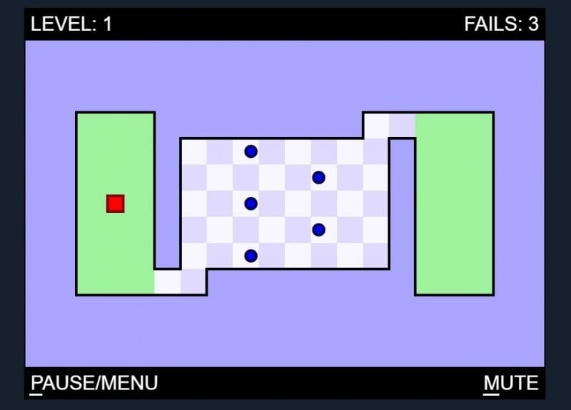
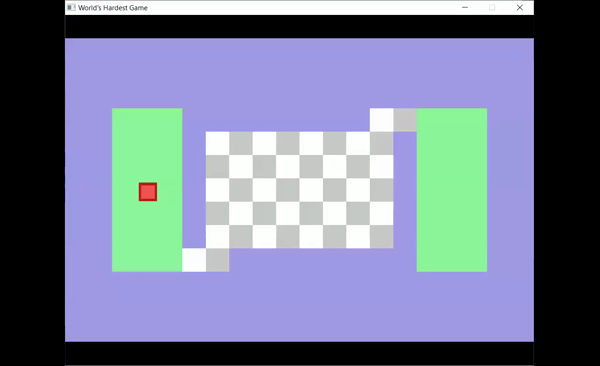
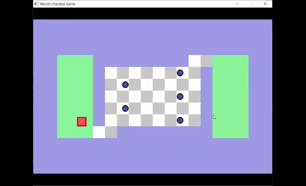
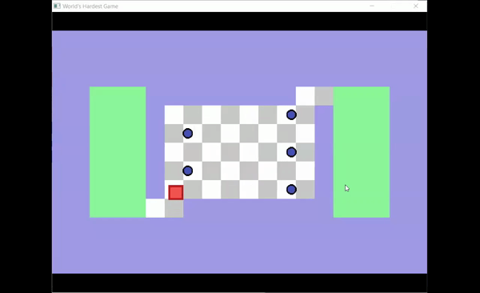
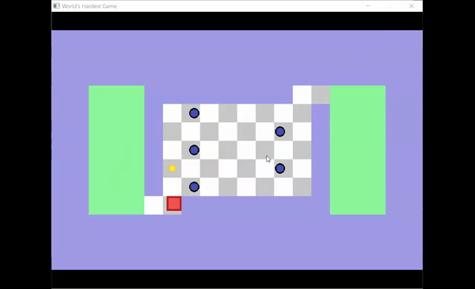
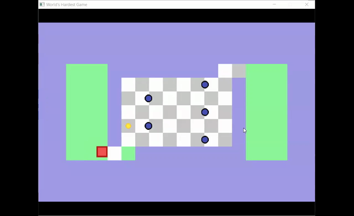
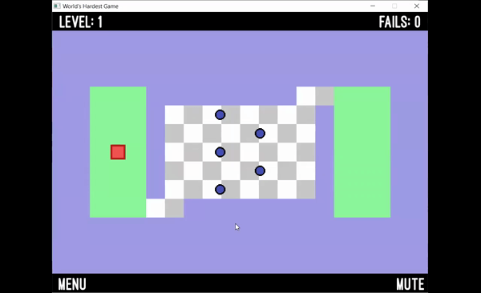

# Example: The World's Hardest Game

Mitchell Toth

May 2021

TDAHelper is very versatile in the top-down adventure games it supports. As an example demo, let's create a clone of *The World's Hardest Game*.

The World's Hardest Game is an arcade-style reflex game built atop a tile grid framework. The player, as a red square, must navigate through various fixed-size maps, collecting all the yellow circles while avoiding the blue circles. Touching a blue circle takes the player back to the start or, if the level has checkpoints, back to the last reached checkpoint.

See https://www.coolmathgames.com/0-worlds-hardest-game for the current HTML5 version.

It is a fitting demo game since it displays many of TDAHelper's features: tile grid maps, wall collision, player movement, enemy collision, items, checkpoints, and basic sprites.

Let's see how we can use TDAHelper to implement these features in our very own World's Hardest Game.

# Setup

The first step is to include TDAHelper in our game build. For example, in a project with a "main.cpp" for the game loop and a Game class ("Game.h" and a "Game.cpp") for game logic, we can write within "Game.h":

`#include <TDAHelper/library.hpp>`

# Maps

Let's try to create the first level of The World's Hardest Game. This our goal:



With TDAHelper included, creating the game's tile grid is very easy. To load in a map, first create a map text file. TDAHelper parses map files in the following way:

- Every *pair* of characters represents one tile.
	- The 1st character is the *sprite ID*, which defines the *aesthetic* for that tile. This character tells TDAHelper how to display the tile and can be mapped to a color or texture of choice.
	- The 2nd character is the *type ID*, which defines the *behavior* for that tile. This character tells TDAHelper how to treat the tile. For example, to treat it as a wall or as a checkpoint.
- You may use any characters you like.

For example, the first level on The World's Hardest Game could be encoded in a file "map1.txt" as follows:

`````
h#h#h#h#h#h#h#h#h#h#h#h#h#h#h#h#h#h#h#h#
########################################
########################################
########################################
####s's`s'################``''eeeeee####
####s`s's`##``''``''``''``''##eeeeee####
####s's`s'##''``''``''``''``##eeeeee####
####s`sss`##``''``''``''``''##eeeeee####
####s's`s'##''``''``''``''``##eeeeee####
####s`s's`##``''``''``''``''##eeeeee####
####s's`s'``''################eeeeee####
########################################
########################################
########################################
h#h#h#h#h#h#h#h#h#h#h#h#h#h#h#h#h#h#h#h#
`````

Here, we see that the map is 15 rows x 20 columns. We want the hashtags to define the borders of the map, and we want the s and e tiles to show up as green. We also want to make a checkerboard pattern in the middle and include black bands at the top and bottom.

To define these aesthetic mappings, we can create an instance of **td::SpriteSheet** and use it with an instance of **td::Map**:

```
td::SpriteSheet sprite_sheet = td::SpriteSheet();
sprite_sheet.addSprite('#', sf::Color::Transparent);
sprite_sheet.addSprite('h', sf::Color::Black);
sprite_sheet.addSprite('w', sf::Color::Black);
sprite_sheet.addSprite('`', sf::Color::White);
sprite_sheet.addSprite('\'',sf::Color(200, 200, 200));
sprite_sheet.addSprite('s', sf::Color(139, 246, 153));
sprite_sheet.addSprite('c', sf::Color(139, 246, 153));
sprite_sheet.addSprite('e', sf::Color(139, 246, 153));
```

To add a texture, instead use `sprite_sheet.addTexture` and provide the path to a texture file.

```
td::Map map1 = td::Map("../assets/maps/map1.txt");
map1.setTileSize(64);
map1.setSpriteSheet(sprite_sheet);
```

Here we also set the tile size, which governs the n x n pixel dimensions of each tile. To draw the map in our game, simply call draw() and supply it the target render window:

```
map1.draw(this->window);
```


# Player

Let's add a player that can move around this map. TDAHelper provides a **td::Player** class for this purpose.

Simply create the player and configure the following attributes:

- Set the map that the player will interact with.
- Set the player's size.
- Set the movement keys used to move the player (default is the arrow keys).
- Set the player's move speed (default is 50).
- Set the player's color or texture.

```
td::Player player = td::Player();
player.setMap(this->current_map);
player.setSize((int)(this->tile_size*0.8), (int)(this->tile_size*0.8), true);
player.setMovementKeys(sf::Keyboard::W,sf::Keyboard::A, sf::Keyboard::S, sf::Keyboard::D);
player.setMoveSpeed(30);
player.setTexture("../assets/textures/player.png");
```

Listen for player move events in the game loop. Simply call player.move within the game loop's "update()" section, passing it a time delta:

```
player.move(elapsed);
```

Draw the player in the "render()" section of the game loop:

```
player.draw(this->window);
```


# Player-Map Interaction

The player's starting position is defined in the map text file, and various type IDs in the map define how the player interacts with certain tiles.

Before, we defined an *aesthetic* mapping between characters and colors/textures. To create a *behavioral* mapping, we can map each tile's 2nd character to a desired behavior. Built into TDAHelper are the following types:

- WALL: tiles that cannot be passed over by the player.
- START: a singular tile that defines where the player starts on the map.
- CHECKPOINT: tiles that define checkpoints on the map.
- END: tiles that are considered end/goal tiles on the map.

The default type ID mappings are:

- 'w' = WALL
- 's' = START
- 'c' = CHECKPOINT
- 'e' = END

We may also define a custom mapping. In our case, we want hashtags characters (#) to represent walls. Let's also make the pipe character (|) a wall. This happens on the map level:

```
map1.setTileType(td::Map::TileTypes::WALL, {'#', '|'});
```

When we draw the map and the player, the player will start at the 's' tile we specified in "map1.txt". When moving around, the player will be restricted within the wall tiles we specified.



We can check for events related to these special tile types. Our game logic will be built around these events. For example, we can check if the player has reached an end tile:

```
// Check if the player has reached the end goal
if (player.onEnd()) {
	... Add game logic here ...
}
```

It should also be noted that td::Player instances have health and an inventory. See the sections on Enemies and Items for more details.

# Enemies

Our game isn't very difficult as is. Let's add some moving enemies into the mix. TDAHelper provides a special **td::Enemy** class and td::Map methods for adding enemies.

Enemies move using a waypoint system, and they apply damage to the player whenever they collide with the player. We'll set up each enemy to be slightly smaller than the player, with a harm value of 100, the default maximum player health.

```
td::Map map = map1;
int width = (int)(tile_size*0.55);
int height = (int)(tile_size*0.55);
sf::Color color = sf::Color::Blue;
int harm = 100;
float speed = 58;
enemyMoveOption = td::Enemy::MoveOptions::LOOP;

auto enemy = new td::Enemy(map, width, height, color, harm);
enemy->setWaypoints({{5,13}, {5, 6}});
enemy->setMoveSpeed(speed);
enemy->setMoveOption(enemyMoveOption);
enemy->setTexture("../assets/textures/enemy.png");

map.addEnemy(enemy);
```

There are two options for enemy movement along the waypoints:

1. LOOP: Upon the enemy reaching the last waypoint, the waypoints wrap around and the first waypoint becomes the target of the last.
2. BACK_AND_FORTH: Upon reaching the last waypoint, the enemy's direction is reversed. The enemy steps backwards through the waypoints until reaching the first waypoint, where the player's direction is again reversed.

Code for triggering enemy movement and displaying the maps' enemies:

```
map1.moveEnemies(elapsed);

map1.drawEnemies(this->window);
```



To handle player-enemy collision, simply define the body of the following if-statements. For our purposes, we will apply the enemy's harm if a collision has been detected:

```
if (player.isTouchingEnemy()) {
	for (auto enemy: player.getTouchingEnemies()) {
		player.loseHealth(enemy->getHarm());
	}
}
```

Alternatively, if the enemies are better treated as circles, we can use supported circle collision methods. We'll go with that here:

```
if (player.isTouchingCircleEnemy()) {
	for (auto enemy: player.getTouchingCircleEnemies()) {
		player.loseHealth(enemy->getHarm());
	}
}
```

Now we can check if the player has died, and handle our logic there:

```
// Respawn if player is dead
if (player.isDead()) {
	... Add game logic here ...
	player.respawn();
}
```



# Items

On some levels of The World's Hardest Game, the player needs to pick up yellow circles (coins) before the end tile really "activates". TDAHelper provides a **td::Item** class that can serve this purpose.

Items are obtainable entities that the player can collect. TDAHelper methods can detect when the player is touching an item, upon which game logic can be implemented to "pick up" the item. td::Item instances have two key attributes:

1. obtained = Boolean saying if the player collected this item.
2. committed = Boolean saying if the player can keep this item in inventory after death or some other event.

To include coin items, we can use the following code:

```
td::Map map = map1;
int width = (int)(tile_size*0.55);
int height = (int)(tile_size*0.55);
sf::Color color = sf::Color::Yellow;
int row = 4;
int col = 3;

auto coin = new td::Item(map, width, height, color);
coin->setStartTile(row, col);
coin->setTexture("../assets/textures/coin.png");
map.addItem(coin);
```

Display the map's items:

```
map1.drawItems(this->window);
```

We can check if the player is touching an item and obtain it. For instance:

```
// Handle item collision
if (player.isTouchingItem()) {
	for (auto item: player.getTouchingItems()) {
		player.obtainItem(item);
	}
}
```

After an item is obtained, it no longer gets displayed on the map. Should we want to remove items from the player's inventory, we can do so with `player.clearInventory();` or `player.resetInventory();`. The former removes only the player's uncommitted items, whereas the latter removes all items from the player's inventory, regardless of committed status.



# Checkpoints

If the map has checkpoints, TDAHelper provides methods to check if the player has reached a checkpoint and also to save the player's position at that checkpoint.

Checkpoints are made by specifying a CHECKPOINT tile in the map text file (see section Player-Map Interaction). To mimic The World's Hardest Game, we can include the following code:

```
if (player.onCheckpoint()) {
	player.setCheckpoint();
	// Commit all items in the player's inventory
	// This way, it's a true checkpoint
	for (auto item : player.getInventory()) {
		item->setCommitted(true);
	}
}
```

Now, even if the player dies, the items collected since the last checkpoint will remain in the player's inventory. And the player no longer respawns at the starting location but at the last checkpoint reached.



# Menus

It's looking pretty good! Now we can start adding some final touches. It would be nice if we had some menus and interactive buttons to navigate between game states. TDAHelper has a **td::ClickableMenu** class just for this.

A td::ClickableMenu instance holds a 2D vector of menu options, which can be arranged as desired in a grid, in a row, or in a column. Hovering over a menu option highlights it, and clicking a menu option returns the option text.

Using this functionality, we can make a quick menu and some HUD buttons. While we're at it, let's add a level indicator and a fails counter to the top of the screen.

We can use the following code to make a HUD button that navigates back to the main menu. Notice the 2D vector of options passed in, here containing only the string "MENU". The other configurations passed in are text styling and menu positioning.

```
// HUD menu
// One option for "MENU" to go back to the main menu
td::ClickableMenu mainMenuButton = td::ClickableMenu(this->window, (float)(this->window->getSize().x * 0.01), (float)(this->window->getSize().y * 0.93),
									{10},{{"MENU"}},{.font=this->capsFont, .size=60});
```

```
// Draw the "MENU" button
mainMenuButton.drawMenu();
mainMenuButton.onMouseOver();
```

And to extract the value:

```
std::string selected = mainMenuButton.onMouseClick();
```

(If no menu option was clicked on this frame, onMouseClick() returns the empty string "").



# Audio

TDAHelper also makes it easy to add music and sound effects to our game. Simply use the **td::Music** and **td::Sound** classes.

```
// Game music
this->music = new td::Music("../assets/sounds/music.wav");

// Sounds effects
this->hitEnemySound = new td::Sound("../assets/sounds/enemy-hit.wav");
```

Play the audio with `this->music.play();` or `this->sound.play()`, and similarly stop the audio with `.stop()`.

# And That's It!

In just a few lines of code, we managed to make a level that looks and behaves remarkably similar to The World's Hardest Game.


With TDAHelper, top-down adventure games are a breeze. Try it out! Enjoy!
